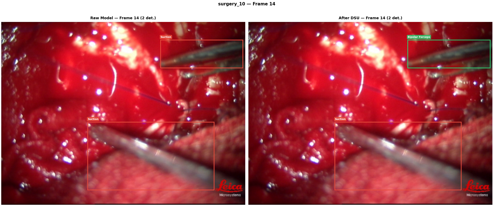
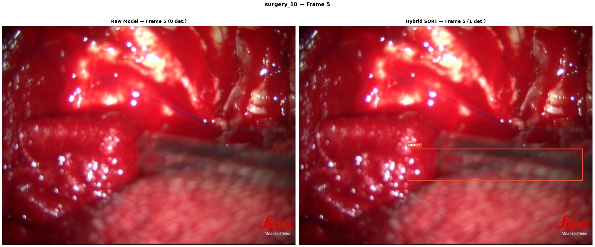
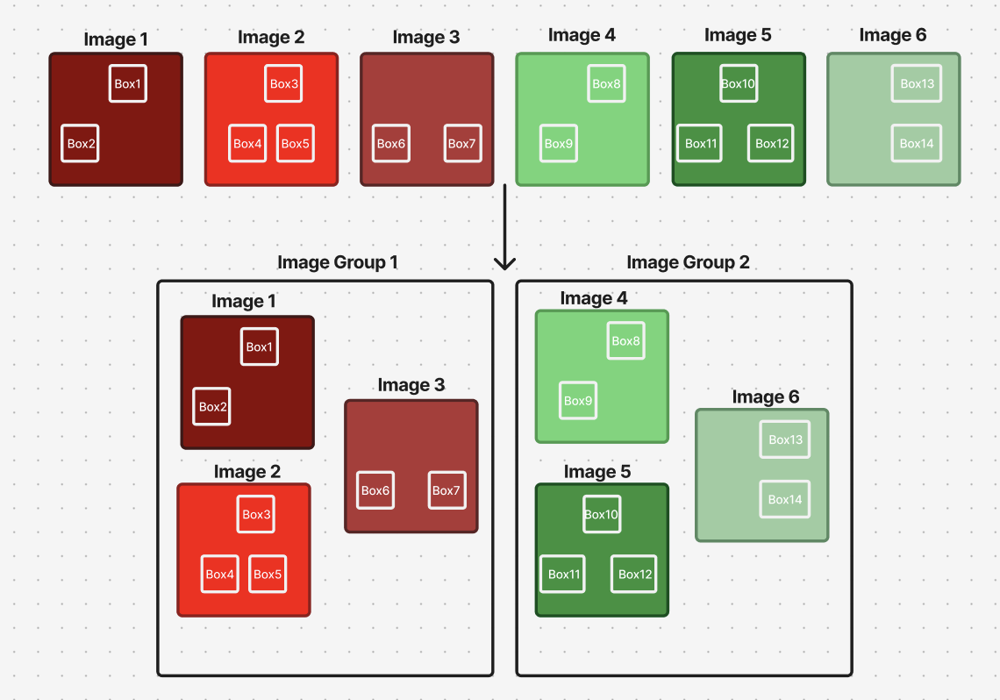
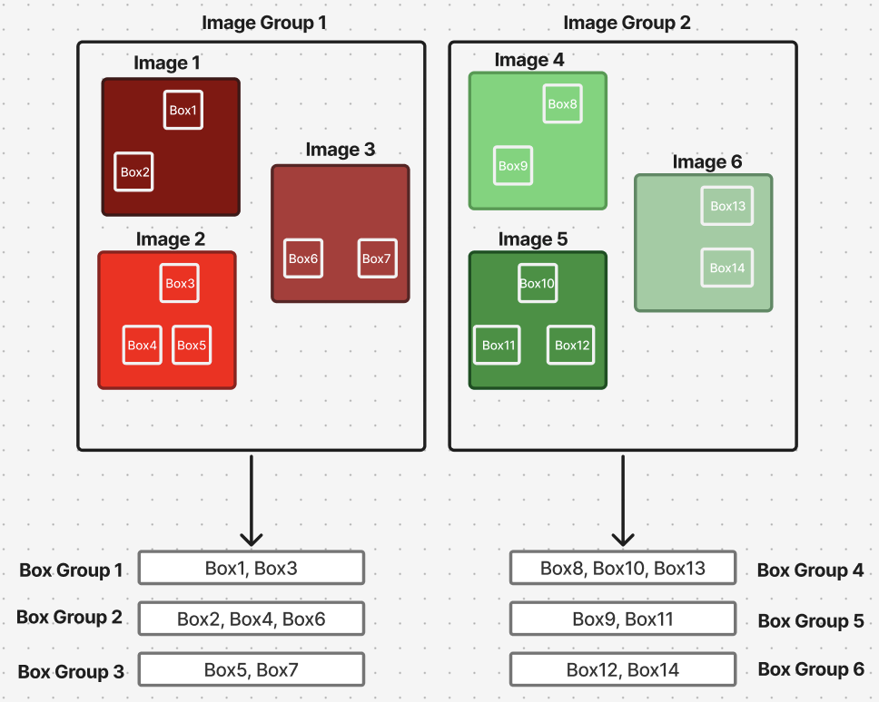

<div align="center">

# 🏥 Neurosurgical Tool Detection & Policy-Based Characterization

<br>

**A Hybrid Framework Combining Deep Learning, Spatial-Temporal Tracking, and Formal Runtime Verification for Automated Surgical Skill Assessment**

<br>

[](https://python.org)
[](https://pytorch.org)
[](https://colab.research.google.com)

<br>

`Neurosurgery` · `Surgical Tool Detection` · `Mask R-CNN` · `Instance Segmentation` · `Formal Verification` · `Runtime Monitoring` · `SORT Tracking` · `DSU Clustering` · `Kalman Filter`

<br>

> 🎯 **F1-Score: 0.9881** · **Classification Accuracy: 99.80%** · **Mean IoU: 0.9369**

</div>

<br>

---

<br>

## 📋 Table of Contents

<details open>
<summary><b>Click to expand</b></summary>

- [🔬 Overview](#-overview)
- [🎯 The Problem](#-the-problem)
- [🏗 Architecture](#-architecture)
- [🔍 Module 1 — Tool Detection & Instance Segmentation](#-module-1--tool-detection--instance-segmentation)
- [🔧 Module 2 — Spatial-Temporal Stabilization](#-module-2--spatial-temporal-stabilization)
  - [Stage A — DSU Clustering](#stage-a--dsu-clustering-fixing-label-flickering)
  - [Stage B — Gap-Filling Methods](#stage-b--gap-filling-methods-fixing-presence-flickering)
  - [Stage C — The Sandwich Architecture](#stage-c--the-sandwich-architecture)
- [🛡 Module 3 — Policy-Based Characterization](#-module-3--policy-based-characterization-via-formal-runtime-monitoring)
- [📊 Results](#-results)
- [📁 Dataset](#-dataset)
- [📂 Repository Structure](#-repository-structure)
- [🚀 Getting Started](#-getting-started)
- [📚 References](#-references)

</details>

<br>

---

<br>

## 🔬 Overview

Automated surgical skill assessment relies on accurately tracking and characterizing instruments from intra-operative videos. However, standard deep learning object detectors process video frames **independently**, leading to physically impossible predictions such as:

| | Failure Mode | Description |
|:-:|:------------|:------------|
| 🔄 | **Temporal Flickering** | A tool's label rapidly switches between classes across consecutive frames |
| 👻 | **Spatial Hallucinations** | Light reflections are detected as tools, making instruments appear to "teleport" |
| ⚠️ | **Logically Impossible States** | Mutually exclusive tools are simultaneously detected for a single surgeon |

<br>

This project introduces a **hybrid framework** that solves all of these problems through three integrated modules:

```
  ① Mask R-CNN Instance Segmentation    →    Precise, pixel-level tool detection
  ② DSU Clustering + Hybrid SORT        →    Mathematically stabilized trajectories
  ③ Formal Runtime Verification         →    Logically guaranteed surgical compliance
```

> 💡 The resulting system not only detects and tracks surgical tools with an **F1-Score of 0.9881** but also automatically flags AI hallucinations and policy violations against established surgical guidelines.

<br>

---

<br>

## 🎯 The Problem

When a Mask R-CNN model is applied to continuous surgical video, it processes each frame in complete isolation — with no memory of what it predicted one frame ago. This causes three critical failure modes:

<br>

### 🏷️ Label Flickering

The model's predicted tool name rapidly alternates (e.g., `Suction → Bipolar Forceps → Suction`) due to tiny changes in camera angle or partial occlusion by tissue.

<div align="center">

<br>
<sub><b>Figure 1:</b> <em>Label Flickering — The raw model misclassifies Bipolar Forceps as Suction in consecutive frames (top row). Our DSU clustering corrects the label to maintain temporal consistency (bottom row).</em></sub>
</div>

<br>

### 👁️ Presence Flickering

A clearly visible tool briefly drops below the model's confidence threshold due to a sudden shadow or motion blur, causing its bounding box to **vanish for one frame** and reappear in the next.

<div align="center">

<br>
<sub><b>Figure 2:</b> <em>Presence Flickering — The raw model fails to detect the Suction tool in a middle frame (top row). Our Hybrid SORT tracking seamlessly bridges the gap (bottom row).</em></sub>
</div>

<br>

### 🚀 Teleporting Tools

The model can be tricked by visual artifacts — like microscope glare on wet tissue — mistaking them for metallic tools. If the model misses the real tool and instead detects a false positive on the opposite side of the frame, the resulting data suggests the tool instantly "teleported" at physically impossible speeds.

<br>

---

<br>

## 🏗 Architecture

Our end-to-end pipeline consists of three major modules executed sequentially:

```
 ╔═══════════════════════════════════════════════════════════════════════╗
 ║                     📹  INPUT: Surgical Video                        ║
 ║                      (25 fps, 640×480, per-frame)                     ║
 ╚═══════════════════════════════╦═══════════════════════════════════════╝
                                 ║
                                 ▼
 ┌───────────────────────────────────────────────────────────────────────┐
 │  MODULE 1: Mask R-CNN (ResNet-50-FPN)                                │
 │  ├── Instance segmentation → pixel-level tool masks                  │
 │  ├── Bounding box regression → spatial localization                  │
 │  └── Custom NMS pipeline → duplicate removal                         │
 └───────────────────────────────┬───────────────────────────────────────┘
                                 │  Raw per-frame predictions
                                 ▼
 ┌───────────────────────────────────────────────────────────────────────┐
 │  MODULE 2: Spatial-Temporal Stabilization  ("Sandwich" Pipeline)      │
 │  ┌───────────────────────────────────────────────────────────────┐    │
 │  │ ① DSU Pass 1 — Frame grouping (SSIM) + Box clustering (IoM)   │    │
 │  │                → Fixes label flickering via majority voting   │    │
 │  ├───────────────────────────────────────────────────────────────┤    │
 │  │ ② Hybrid SORT — Kalman Filter + Hungarian matching            │    │
 │  │                → Bridges occlusion gaps up to 25 frames       │    │
 │  ├───────────────────────────────────────────────────────────────┤    │
 │  │ ③ DSU Pass 2 — Re-verify labels on interpolated boxes         │    │
 │  │                → Guarantees temporal label consistency        │    │
 │  └───────────────────────────────────────────────────────────────┘    │
 └───────────────────────────────┬───────────────────────────────────────┘
                                 │  Stabilized tool trajectories
                                 ▼
 ┌───────────────────────────────────────────────────────────────────────┐
 │  MODULE 3: Formal Runtime Monitoring  (easy-rte)                     │
 │  ├── 5 surgical policies encoded as Finite State Machines            │
 │  ├── Frame-by-frame trace verification against policies              │
 │  └── Violation detection → flags AI hallucinations & unsafe states   │
 └───────────────────────────────┬───────────────────────────────────────┘
                                 ║
                                 ▼
 ╔═══════════════════════════════════════════════════════════════════════╗
 ║                   ✅  OUTPUT: Verified Clinical Metrics              ║
 ║   ├── Violation reports for surgical skill assessment                 ║
 ║   └── Logically guaranteed, hallucination-free characterization       ║
 ║   └── Logically guaranteed, hallucination-free characterization       ║
 ╚═══════════════════════════════════════════════════════════════════════╝
```

<br>

---

<br>

## 🔍 Module 1 — Tool Detection & Instance Segmentation

We utilize a **Mask R-CNN** architecture with a **ResNet-50-FPN** backbone for pixel-level instance segmentation of four microsurgical tool classes:

<div align="center">

| Index | Tool | Description |
|:-----:|:-----|:------------|
| T₁ | **Suction** | Thin tube used to aspirate blood and fluids from the surgical field |
| T₂ | **Cusa** | Cavitron Ultrasonic Surgical Aspirator for precise tissue removal |
| T₃ | **Bipolar Forceps** | Forceps that coagulate tissue using bipolar electrical current |
| T₄ | **Dissecting Forceps** | Forceps used for fine tissue dissection and manipulation |

</div>

<br>

### Why Mask R-CNN over YOLO?

While previous work ([Ramesh et al., 2021](https://ieeexplore.ieee.org/document/9630317)) used YOLOv5 for basic bounding box detection, we chose Mask R-CNN because it adds a **parallel branch for predicting pixel-level object masks**. This is crucial for neurosurgery where tools like suction tubes are long, thin, and often overlapping. By extracting the exact pixel footprint, we can confidently track the tool's **centerline and tip** via skeletonization, rather than relying on a generic bounding box center.

### Custom NMS Pipeline

The raw model output undergoes a two-stage Non-Maximum Suppression:

| Stage | Method | Threshold | Purpose |
|:-----:|:-------|:---------:|:--------|
| 1 | **Mask IoU NMS** | IoU > 0.20 | Suppresses lower-confidence overlapping masks |
| 2 | **Box Containment NMS** | Geometric check | Removes nested duplicate detections |

<br>

---

<br>

## 🔧 Module 2 — Spatial-Temporal Stabilization

### Stage A — DSU Clustering (Fixing Label Flickering)

We implement a **Disjoint Set Union (DSU)** graph algorithm that operates in two hierarchical levels:

<br>

#### Level 1: Frame Grouping via SSIM

Consecutive frames are compared using the **Structural Similarity Index (SSIM)**. If `SSIM(Frameᵢ, Frameⱼ) ≥ 0.75`, the frames are merged into the same cluster using the DSU data structure.

<div align="center">

<br>
<sub><b>Figure 3:</b> <em>DSU-based grouping of visually similar frames using SSIM thresholding. Frames within each cluster represent a temporally stable surgical scene.</em></sub>
</div>

<br>

#### Level 2: Bounding Box Clustering via IoM

Within each frame cluster, bounding boxes are compared using **Intersection over Minimum (IoM)**. If two boxes of the same class overlap by more than 75%, they are merged — the larger box is kept.

<div align="center">

<br>
<sub><b>Figure 4:</b> <em>Spatially overlapping bounding boxes across grouped frames are clustered to identify the same physical tool instance.</em></sub>
</div>

<br>

#### Level 3: Majority Voting

For each box cluster, a **majority vote** determines the final label. This winning label is assigned to every box in the cluster, completely eliminating label flickering:

$$y^* = \arg\max_y \sum_{i=1}^{n} \mathbb{1}(y_i = y)$$

<br>

---

### Stage B — Gap-Filling Methods (Fixing Presence Flickering)

We implemented and compared **7 gap-filling methods** to bridge false negatives (missing detections):

<div align="center">

| # | Method | Strategy | Key Feature |
|:-:|:-------|:---------|:------------|
| 1 | Normal Temporal Interpolation | ±2 frame window | Simple 50/50 average of nearest boxes |
| 2 | Advanced Temporal Interpolation | Weighted kinematic | Accounts for temporal distance + **150px anti-teleportation** |
| 3 | Linear Interpolation | Literature baseline | Bridges gaps up to 25 frames (1 second) |
| 4 | Advanced Linear Interpolation | Optimized O(N) pass | Hardened with anti-teleportation constraint |
| 5 | Template Matching | Visual tracking | `cv2.matchTemplate` with Normalized Cross-Correlation |
| 6 | SORT Tracking | Kalman + Hungarian | Maintains tool identity via predictive kinematics |
| 7 | **Hybrid SORT** *(Ours)* | **Kalman identity + Linear boxes** | **Smooth bounding boxes with robust identity tracking** |

</div>

<br>

#### 🌟 The Hybrid SORT Algorithm (Our Proposed Solution)

The Hybrid SORT method models each tool's state in **7 dimensions** using a Kalman Filter:

$$\mathbf{x} = [c_x, \ c_y, \ s, \ r, \ \dot{c}_x, \ \dot{c}_y, \ \dot{s}]^T$$

| Symbol | Meaning |
|:------:|:--------|
| $(c_x, c_y)$ | Bounding box center coordinates |
| $s, r$ | Scale (area) and aspect ratio |
| $(\dot{c}_x, \dot{c}_y, \dot{s})$ | Respective velocities over time |

When a tool temporarily disappears, the Kalman Filter projects **"ghost tracks"** forward based on last-known velocity. The Hungarian algorithm associates a re-emerging tool with its correct historical ID (up to **25 frames / 1 second**).

> 💡 **Key Insight:** Unlike pure SORT, the Hybrid version uses Kalman predictions **only for identity maintenance**, while actual bounding boxes are drawn via smooth temporal interpolation — completely eliminating predictive jitter.

<br>

---

### Stage C — The Sandwich Architecture

All post-processing follows a strict **"Sandwich" pipeline**:

```
  ┌─────────────┐      ┌───────────────────────┐      ┌─────────────┐
  │  DSU Pass 1 │  ──► │ Gap-Fill (Hybrid SORT)│  ──► │ DSU Pass 2  │
  └─────────────┘      └───────────────────────┘      └─────────────┘
   Fix existing          Track & interpolate            Re-verify new
   label conflicts       across occlusions              box labels
```

**Why this specific order?**

| Pass | Purpose |
|:----:|:--------|
| **DSU Pass 1** | Resolves existing spatial conflicts and establishes temporally stable class labels via majority voting |
| **Gap-Filling** | Tracks tools across occlusions and interpolates **new** bounding boxes into the gaps |
| **DSU Pass 2** | Forces newly interpolated boxes to inherit the majority-voted label of their surrounding temporal cluster |

> This architecture guarantees that no newly generated bounding box can introduce a label that contradicts the temporal consensus.

<br>

---

<br>

## 🛡 Module 3 — Policy-Based Characterization via Formal Runtime Monitoring

Once tool trajectories are stabilized, we route the data through a **formal runtime verification** module to catch logically impossible surgical states that pure computer vision cannot detect.

<br>

### Verification Architecture

```
  ┌──────────────┐     Raw Detections       ┌──────────────┐     Verdicts     ┌──────────────┐
  │  Mask R-CNN  │  ──────────────────────► │   Monitor    │ ───────────────► │  Surgeon /   │
  │  & Tracking  │       (Inputs)           │              │    (Outputs)     │    Logs      │
  └──────────────┘                          └──────▲───────┘                  └──────────────┘
                                                   │
                                             Property φ
                                          (Surgical Policies)
```

The monitor is **strictly unidirectional** — it evaluates the ML pipeline's outputs against formal policies but establishes no reverse feedback loop.

<br>

### Framework: easy-rte

We utilize the [**easy-rte**](https://github.com/PRETgroup/easy-rte) open-source toolchain for runtime enforcement. Policies are encoded in `.erte` configuration files and modeled as **Finite State Machines (FSMs)** with two states:

- **`s₀`** — Safe / accepting state (normal operation)
- **`violation`** — Policy breach detected

Each video frame is evaluated independently: the FSM resets to `s₀` before each frame, and the resulting state is reported.

<br>

### Encoded Surgical Policies

<div align="center">

| Policy | Rule | Clinical Rationale |
|:------:|:-----|:-------------------|
| **P1** | Suction and Bipolar Forceps cannot be active simultaneously | Physical constraint — a single surgeon cannot hold both |
| **P2** | Dissecting Forceps cannot exceed max continuous usage | Safety — prevents tissue damage from prolonged application |
| **P3** | Suction cumulative usage must not exceed global limit | Resource management — monitors total active time |
| **P4** | Dissecting Forceps must observe a cooldown period | Recovery — mandates rest interval between intensive tasks |
| **P5** | Cusa requires prior Dissecting Forceps usage | Workflow sequencing — formalizes surgical precedence |

</div>

<br>

**Extended Input Alphabet:**

```
CONSEC_Tool              →  Consecutive frames a tool has been active
CONSEC_OFF_Tool          →  Consecutive frames a tool has been inactive
TOTAL_Suction            →  Cumulative usage counter across entire procedure
IN_COOLDOWN_Dissecting   →  Boolean recovery flag
Dissecting_Ever_Used     →  Logical precedence flag
```

<br>

---

<br>

## 📊 Results

### Overall Detection Performance — DSU + Hybrid SORT + DSU

<div align="center">

| Metric | @IoU=0.5 | @IoU=0.75 |
|:-------|:--------:|:---------:|
| **Precision** | 0.9842 | 0.9822 |
| **Recall** | 0.9920 | 0.9900 |
| **F1-Score** | **0.9881** | **0.9861** |
| **Classification Accuracy** | 0.9980 | 0.9980 |
| **Mean IoU (matched)** | 0.9369 | 0.9374 |

</div>

<br>

### COCO-Style Evaluation — mAP@[.5:.95]

<div align="center">

| Metric | Score |
|:-------|:-----:|
| **Average Precision** | 0.9097 |
| **Average Recall** | 0.9169 |
| **Average F1** | 0.9133 |

</div>

<br>

---

<br>

## 📁 Dataset

The dataset comprises intra-operative neurosurgical video recordings of **Insular Glioma resections** performed at the **National Institute of Mental Health and Neurosciences (NIMHANS), India** from 2011–2017.

- **Microscopes:** Leica OH5 / Leica OH6
- **Frame Rate:** 25 fps
- **Resolution:** 640 × 480
- **Ethics Approval:** NIMHANS Protocol No. `NIMHANS/37thIEC(BS&NSDIV.)/2022`

<br>

<div align="center">

| Tool | Train | Test | Total |
|:-----|:-----:|:----:|:-----:|
| Suction | 3,807 | 949 | 4,756 |
| Cusa | 2,307 | 408 | 2,715 |
| Bipolar Forceps | 56 | 184 | 240 |
| Dissecting Forceps | 464 | 111 | 575 |
| **All** | **6,634** | **1,652** | **8,286** |

</div>

<br>

---

<br>

## 📂 Repository Structure

```
Neurosurgical-tool-detection-and-policy-based-Characterization/
│
├── 📜 FINAL_PE_object_detection.py      # Complete detection & tracking pipeline
│                                         #   ├── Mask R-CNN inference + Custom NMS
│                                         #   ├── DSU Label Correction (SSIM + IoM)
│                                         #   ├── 7 Gap-Filling methods (incl. Hybrid SORT)
│                                         #   ├── Detection Evaluation (mAP, IoU, F1)
│                                         #   └── Visualization utilities
│
├── 📂 easy-rte/                          # Formal runtime enforcement toolchain
│   ├── goEFB/                            #   Go-based enforcer/monitor backend
│   └── ...                               #   Policy compiler & FSM synthesizer
│
├── 📂 assets/                            # README images & figures
│   ├── Frame_5.png                       #   Presence flickering example
│   ├── Frame_14.png                      #   Label flickering example
│   ├── frame_grouping.png                #   DSU frame grouping diagram
│   └── box_grouping.png                  #   Bounding box clustering diagram
│
└── 📄 README.md                          # This file
```

<br>

---

<br>

## 🚀 Getting Started

### Prerequisites

```bash
pip install torch torchvision
pip install scikit-image scikit-learn
pip install opencv-python
pip install filterpy                 # Kalman Filter for SORT tracking
pip install numpy matplotlib pillow
```

### Quick Start (Google Colab)

```python
# ──────────────────────────────────────────────────────────────
# Step 1: Mount Google Drive & Load Model
# ──────────────────────────────────────────────────────────────
from google.colab import drive
drive.mount('/content/gdrive')

import torch
device = torch.device('cuda' if torch.cuda.is_available() else 'cpu')
model = torch.load('path/to/trained_maskrcnn_model.pth', map_location=device)
model.to(device)
model.eval()

# ──────────────────────────────────────────────────────────────
# Step 2: Run Baseline Inference on Surgery Frames
# ──────────────────────────────────────────────────────────────
predictor = BaselinePredictor(model, device, num_classes=6, conf_threshold=0.3)
predictor.run_inference(surgery_dirs=["surgery_1", "surgery_2"], images_root=IMAGES_ROOT)
predictor.save_all(OUTPUT_DIR)

# ──────────────────────────────────────────────────────────────
# Step 3: Apply the Sandwich Pipeline (DSU + Hybrid SORT + DSU)
# ──────────────────────────────────────────────────────────────
# DSU Pass 1: Fix label flickering
dsu_corrector = DSULabelCorrector(IMAGES_ROOT, ssim_threshold=0.75)
dsu_corrector.apply_all(predictor)

# Gap-Fill: Bridge presence flickering with Hybrid SORT
processor = GapFillingProcessor(dsu_corrector, IMAGES_ROOT)
processor.run_method(
    "DSU + Hybrid SORT + DSU",
    processor.hybrid_sort_interp,
    max_age=25          # Bridge gaps up to 1 second (25 frames)
)

# ──────────────────────────────────────────────────────────────
# Step 4: Visualize Results
# ──────────────────────────────────────────────────────────────
viz = DetectionVisualizer(IMAGES_ROOT, LABEL_TO_NAME)

surgery = "surgery_1"
baseline_pv = predictor.get_preds_video(surgery)
corrected_pv = processor.get_preds_video("DSU + Hybrid SORT + DSU", surgery)

# Side-by-side comparison: Raw vs Corrected
viz.compare(surgery, baseline_pv, corrected_pv,
            frame_id=15, titles=["Raw Model", "After Sandwich Pipeline"])
```

<br>

---

<br>

## 📚 References

### Core References

| # | Paper | Venue | Link |
|:-:|:------|:------|:----:|
| 1 | Ramesh et al. — *Microsurgical Tool Detection and Characterization in Intra-operative Neurosurgical Videos* | IEEE EMBC 2021 | [📄](https://ieeexplore.ieee.org/document/9630317) |
| 2 | He et al. — *Mask R-CNN* | IEEE ICCV 2017 | [📄](https://arxiv.org/abs/1703.06870) |
| 3 | Bewley et al. — *Simple Online and Realtime Tracking (SORT)* | IEEE ICIP 2016 | [📄](https://arxiv.org/abs/1602.00763) |
| 4 | Wang et al. — *Image Quality Assessment: From Error Visibility to Structural Similarity (SSIM)* | IEEE TIP 2004 | [📄](https://ieeexplore.ieee.org/document/1284395) |
| 5 | Pearce, Pinisetty, Roop et al. — *easy-rte: Smart I/O Modules for Mitigating Cyber-Physical Attacks* | IEEE TII 2020 | [📄](https://ieeexplore.ieee.org/document/9050729) · [💻](https://github.com/PRETgroup/easy-rte) |
| 6 | Gupta, Shankar, Pinisetty — *Automated Surgical Procedure Assistance Framework using DL and Formal Runtime Monitoring* | RV 2022 | [📄](https://link.springer.com/chapter/10.1007/978-3-031-17196-3_9) |

### Additional References

- Sarikaya et al. — *Detection and Localization of Robotic Tools in Robot-Assisted Surgery Videos*. IEEE TMI 2017.
- Jin et al. — *Tool Detection and Operative Skill Assessment in Surgical Videos Using Region-Based CNNs*. IEEE WACV 2018.
- Choi et al. — *Surgical-Tools Detection Based on CNN in Laparoscopic Robot-Assisted Surgery*. IEEE EMBC 2017.
- Nwoye et al. — *Weakly Supervised ConvLSTM for Tool Tracking in Laparoscopic Videos*. IJCARS 2019.
- Bauer et al. — *Runtime Verification for LTL and TLTL*. ACM TOSEM 2011.
- Falcone et al. — *Runtime Verification of Safety-Progress Properties*. RV 2009.

<br>
